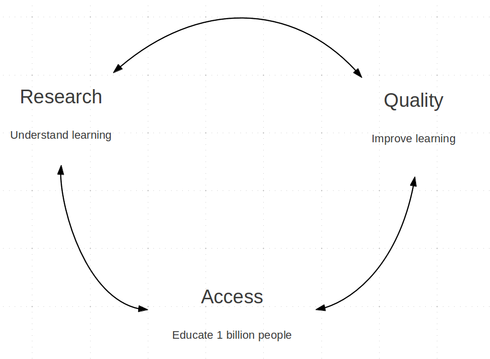
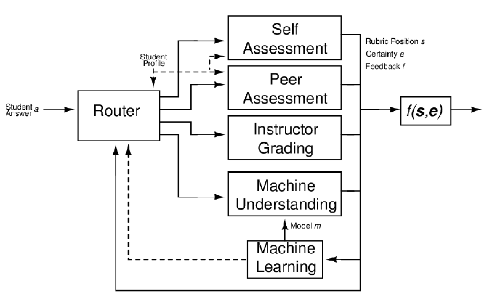
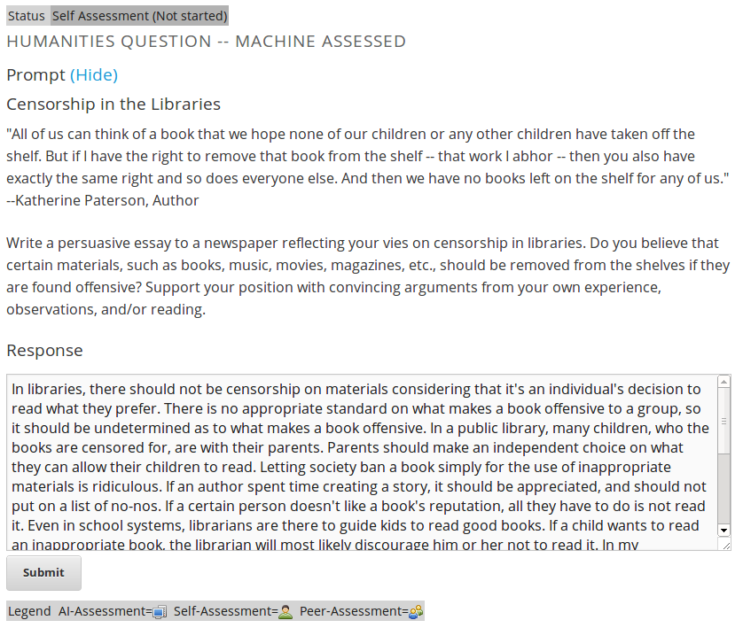
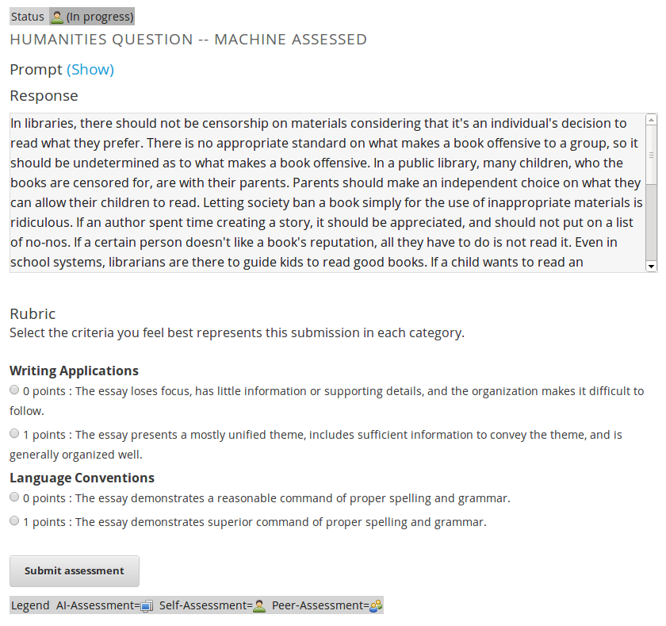
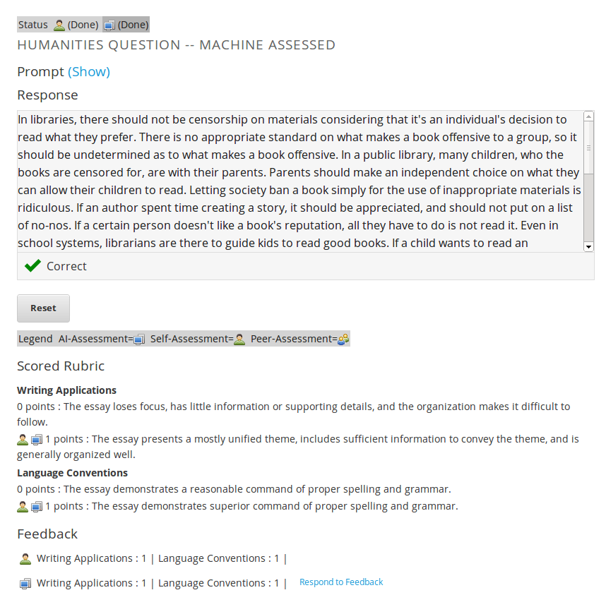

## What is edX?

---
## Assessment in MOOCs

### All aspects of a MOOC must scale to thousands

---

---

---
## Remaining Problems

### Short answers
### Forum posts
### Essays
### Pictures
### Videos
### ...

---
## Approaches

### Portfolios
### Artificial intelligence
### Self-assessment
### Peer assessment
### Instructor/TA

---
## Goals

### Maximize accuracy of assessment
### Minimize cost (where grading can be a hassle)

---
## Framework

---
## Self Assessment
* Self assessment allows students to answer a question, see a rubric, and rate themselves.
  * Requires no grading effort from course staff.
  * Particularly valuable in learning sequences where the goal is to learn by constructing knowledge.

---
## AI Assessment
* A computer algorithm scores student submission.
  * Machine Learning (ML) creates a model using 100 course staff graded responses. 
  * This model is used to automatically grade students.
  * For many problems, similar to course staff grading each student individually, but with much less effort.

---
## Peer Assessment
* Peer assessment involves students giving each other scores and feedback
  * Significant pedagogical value for both the student being graded and the grader.
  * Graders first learn how to grade the problem by looking at instructor graded examples.
  * Features such as smart peer matching and user flagging of inappropriate submissions address concerns with previous online peer grading implementations.

---
## Flexible Assessment Types
* Any of the previous 3 assessement types can be used together.
  * A single student response can pass through any combination of graders.
  * For example, a response could be self-assessed, then ML graded. If the two mismatch, peer grading can be used to confirm.

---
## Current Student Problem Interface
Student Submission  |  Student Self-Assesses | External Grader Results
------------- | ------------- | -------------
 |  | 

---
## Questions?
